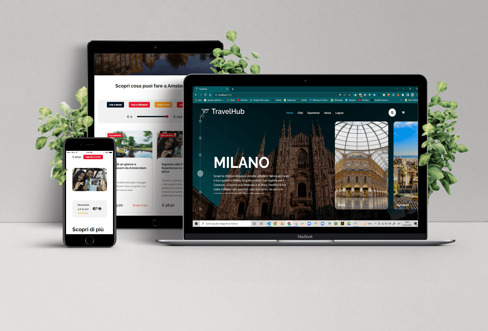

<p align="center">
  
    
</p>
<h2 align="center" >La web app per pianificare i tuoi viaggi ed esplorare il mondo</h2>

<p align="center"></p>
<br>
 
 <h3>Descrizione del progetto</h3>
 <hr height:"2"/>
 <p >Il progetto, sviluppato nell'arco di tre settimane, consiste nella creazione di una piattaforma che permetta all'utente di scegliere una città da visitare e sfogliare il catalogo di tutte le esperienze e le attività correlate a quella città.
 Il progetto è stato svolto da un team di 5 sviluppatori junior coordinati da uno sviluppatore senior. Il team, che ha utilizzato Next.JS per la costruzione della web app, ha organizzato il lavoro seguendo i principi della metodologia Agile e adottando il framework Kanban.</p>
 <br>

 <h3 >Tecnologie</h3>
 <hr height:"2"/>
   <p></p>
   <p></p>
 <br>

 <h3>Funzionalità</h3>
 <hr height:"2"/>
      <ul>
        <li>UI/UX responsive design</li>
        <li>Musement API</li>
        <li>Routing</li>
        <li>Redux per lo state management</li>
        <li>Middleware thunk</li>
        <li>Lazy loading</li>
    </ul>
 <br>
 
 <h3>Performance</h3>
 <hr height:"2"/>
 
 Ottimizzazione tramite **Lighthouse**

<p></p>
<p></p>
<br>
 
 <h3>Come avviare il progetto</h3>
 <hr height:"2"/>

Questo progetto [Next.js](https://nextjs.org/) è stato avviato con [`create-next-app`](https://github.com/vercel/next.js/tree/canary/packages/create-next-app).

Avvia il server di sviluppo:

```bash
npm run dev
# or
yarn dev
```

Apri [http://localhost:3000](http://localhost:3000) nel tuo browser per vedere il risultato.

Puoi modificare direttamente `pages/index.js` e la pagina si aggiornerà automaticamente.
<br>
 
 <h3>Team</h3>
 <hr height:"2"/>


   -[**Agnese Spinella**](https://github.com/AgneseSpinella)
   <br>
   -[**Dario Castiglione**](https://github.com/Dario-Castiglione)
   <br>
   -[**Davide Missiato**](https://github.com/DMissiato)
   <br>
   -[**Federica Santoro**](https://github.com/federicasantoro93)
   <br>
   -[**Roberta Pennisi**](https://github.com/RobertaPennisi)

  Team guidato da [**Casimiro P. Ciancimino**](https://github.com/casiimir)
  

Si ringrazia tutto il team di [**Edgemony**](https://github.com/edgemony-coding-bootcamp) e le aziende per averci permesso di prendere parte a questo percorso!
